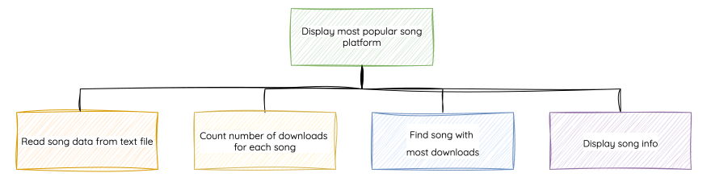
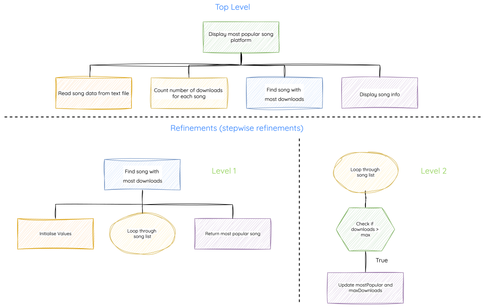

# Structure Diagrams

!!! info "What You Need to Know"

    You must be able to read, understand, create, and implement designs using **structure diagrams**.

<iframe width="560" height="315" src="https://www.youtube.com/embed/1Kd9ji1b-nI?si=R6Ne-OpBshpYifjR" title="YouTube video player" frameborder="0" allow="accelerometer; autoplay; clipboard-write; encrypted-media; gyroscope; picture-in-picture; web-share" referrerpolicy="strict-origin-when-cross-origin" allowfullscreen></iframe>

## Purpose

A **structure diagram** shows how a program is broken into modules.

Each box represents one task. The highest level shows the main parts of the program, and lower levels show how those parts are refined into smaller tasks.

Structure diagrams are useful when you want to see the overall organisation of a program before thinking about detailed code.

## Reading a Structure Diagram

When reading a structure diagram, look for:

- the overall problem at the top
- the main modules below it
- any smaller tasks below a module
- data flow labels or arrows

The example below shows a program that finds and displays the most-downloaded song on a streaming platform.

<figure markdown="span">
  { width="1200" }
</figure>

## Showing Data Flow

Data flow can be added to a structure diagram using labels or arrows.

<figure markdown="span">
  { width="800" }
</figure>

Use:

- `IN` for data passed into a module
- `OUT` for data passed out of a module

For a more detailed explanation of what counts as data flow, see [Data Flow In and Out](3.1.3-data-flow-in-out.md).

## Data Flow Tables

If the diagram becomes crowded, the same information can be shown in a table.

<figure markdown="span">
  { width="450" }
</figure>

Tables are often clearer when several arrays or variables move between modules.

## Showing Refinements

A module can be broken into smaller tasks below it.

<figure markdown="span">
  { width="800" }
</figure>

These smaller tasks are refinements. They explain how a module works without writing the full program code.

## Check Your Diagram

A good Higher structure diagram should make these questions easy to answer:

- What are the main modules?
- What data does each module need?
- What data does each module produce?
- Which modules have been refined?
- Could the modules become procedures or functions?

