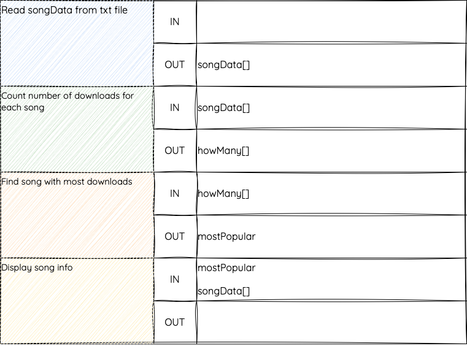

# Data Flow In and Out

!!! info "What You Need to Know"

    You must be able to identify the data that flows **into** and **out of** modules in a design.

## Purpose

**Data flow** is the information passed between modules.

Use:

- `IN` for data a module needs
- `OUT` for data a module produces

Example:

```text
Calculate percentages
IN: prelimMark(), courseMark()
OUT: percentage()
```

This module needs `prelimMark()` and `courseMark()` before it can work. It produces `percentage()` for another module to use later.

## What Counts as Data Flow?

Data flow is only about data being passed between modules.

| Action | Is it data flow? | Why? |
|---|---|---|
| User types a mark | No | The data comes from the user |
| A module reads names from a file | No | The file is external to the module structure |
| A module passes `names()` to another module | Yes | Data moves between modules |
| A module displays a result on screen | No | The result is sent to the user |
| A module returns `topPosition` | Yes | Data is passed back to another part of the program |

!!! warning "Common mistake"

    Do not list the keyboard, screen, or a file as data flow. Show the variables or arrays that are passed between modules.

## In, Out, and In/Out

| Direction | Meaning | Example |
|---|---|---|
| `IN` | Data passed into a module | `names()` |
| `OUT` | Data passed out of a module | `foundPosition` |
| `IN/OUT` | Data passed in, changed, and passed back out | `total` |

Some designs show changed data as both `IN` and `OUT`. The important point is that the data movement is clear.

## Data Flow in Pseudocode

```text
1 Get song data
  OUT: songName(), artistName(), downloads()

2 Find most-downloaded song
  IN: downloads()
  OUT: topPosition

3 Display most-downloaded song
  IN: songName(), artistName(), downloads(), topPosition
```

The first module may read from a file, but the file is not shown as `IN`. The arrays are shown as `OUT` because they are passed to later modules.

## Data Flow in a Structure Diagram

<figure markdown="span">
  { width="800" }
</figure>

The same information can be shown in a table if the diagram becomes crowded.

<figure markdown="span">
  { width="450" }
</figure>

## Link to Parameters

Data flow helps you decide the parameters for procedures and functions.

```text
Find position of pupil with top mark
IN: percentage()
OUT: topPosition
```

This could become a function that receives `percentage` as a parameter and returns `topPosition`.

## Checklist

A good data flow design should:

- use meaningful data names
- show arrays clearly, often using brackets such as `marks()`
- avoid listing files, screens, or keyboards as data flow
- match the modules in the structure diagram or pseudocode
- make the parameters for implementation clear

